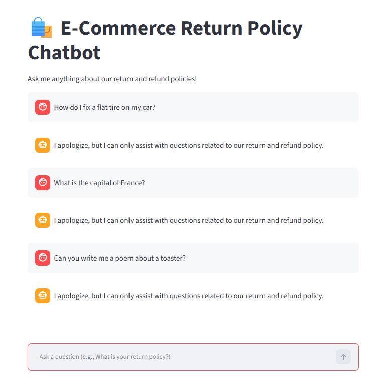

# 🛍️ E-Commerce Return Policy Chatbot

This is a Retrieval-Augmented Generation (RAG) chatbot built with **Streamlit**, **LangChain**, and **Groq** to answer customer questions strictly based on a company's return policy. 

## Features
- **Instant Answers**: Get immediate responses to return policy questions.
- **Strict Guardrails**: Prevents AI hallucinations by strictly adhering to the provided policy document. 
- **Local Embeddings**: Uses `sentence-transformers` for fast, free local vector search via FAISS.

## Testing the Bot's Guardrails

I extensively tested the chatbot to ensure it handles various edge cases correctly and doesn't invent information. 

### 1. Handling Off-Topic Questions (Anti-Hallucination)
To ensure the bot acts purely as a customer service assistant and doesn't hallucinate, I implemented a strict system prompt. As you can see in my testing, if you ask it something completely unrelated (like how to fix a flat tire, the capital of France, or writing a poem), it safely catches it and politely refuses:

*(The bot correctly responds: "I apologize, but I can only assist with questions related to our return and refund policy.")*

### 2. Tricky Policy Questions
I also tested the bot on specific, tricky rules from the policy to ensure it retrieves the exact conditions rather than giving generic answers:
- **Clearance Items**: When asked about clearance items, it correctly states they are final sale and cannot be returned.
- **Time Limits**: It enforces the 30-day limit for refunds.
- **Damaged Goods**: It correctly identifies the exception that the customer doesn't pay for return shipping if the item arrived damaged.

### 3. "Brutal" Multi-Conditional Edge Cases
To really stress-test the LLM's reasoning capabilities, I added complex, multi-layered rules to the policy. The bot successfully parses these difficult scenarios:
- **Electronics & Restocking Fees**: If asked *"I opened my new laptop 10 days ago and want to return it,"* the bot correctly identifies that it falls within the 14-day electronics window but warns the user about the 15% broken-seal restocking fee.
- **Missing Receipts**: If asked *"I lost my receipt for a shirt,"* it informs the user they will only receive store credit for the lowest selling price in the last 60 days.
- **Holiday Sales**: If asked *"Can I get a refund for a TV I bought on Black Friday?"* it strictly denies the refund and offers an exchange only.

### 4. Missing Information
If asked about a topic not covered in the text (like international returns), the bot gracefully falls back to the guardrail rather than making up a fake policy.

---

## Getting Started
1. Add your Groq API key to the `.env` file (`GROQ_API_KEY=your_key_here`).
2. Install dependencies: `pip install -r requirements.txt`
3. Run the app: `streamlit run app.py`
